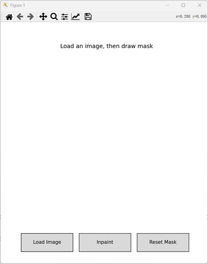
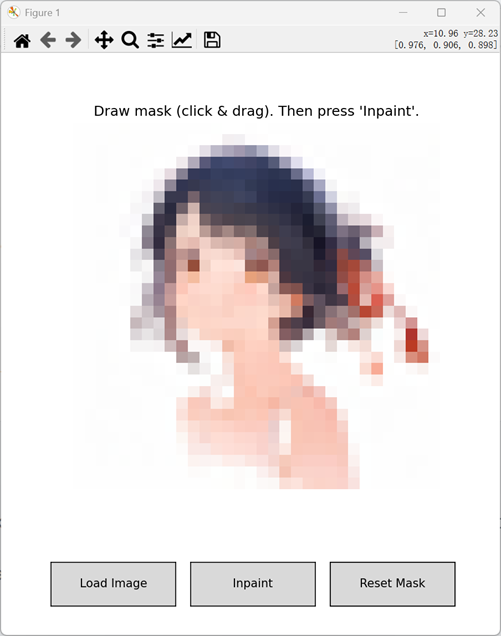
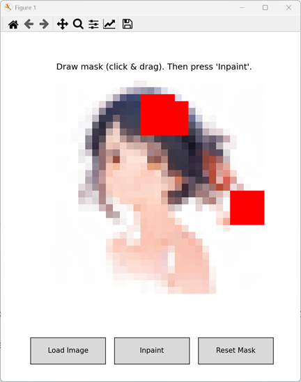
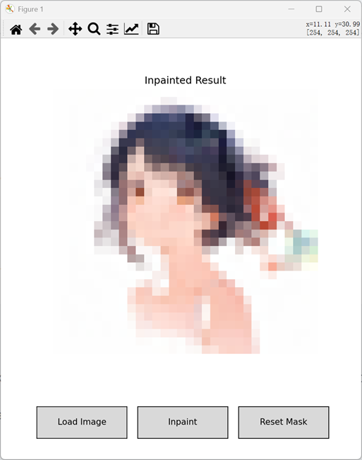

# README

This project implements an image inpainting algorithm using flow matching techniques. The inpainting is performed by learning a vector field that maps noisy images to clean ones, and then using an ordinary differential equation (ODE) solver to sample the inpainted images.

The project was completed by[Yue Su](https://github.com/Selen-Suyue)，[Ting Wang](https://github.com/aiwtw)，[Shulei Zeng](https://github.com/SLEK1226)，[Yixuan Xue](https://github.com/02-darling-ops)，[Rui Liu](https://github.com/Asuna0930111)


## File Structure

```plaintext
├── train.py              # Main training script
├── unet.py               # Definition of the conditional U-Net model
├── flow_matcher.py       # Flow matching and inpainting functions
├── dataset.py            # Dataset loading and mask generation functions
└── inpaint_gui.py        # Graphical user interface for inpainting
```


## How to Run

### 1.Install required libraries

Create a new virtual environment and install the necessary packages:

```bash
conda create -n flow_inpaint python==3.11
conda activate flow_inpaint
pip install torch torchvision numpy pillow matplotlib tqdm
```

### 2.Train the model

To train the model, run the following command:

```bash
python train.py
```

The training script will download the CIFAR-10 dataset if it is not already present, and start training the model. The trained model will be saved in the `saved_models` directory every 5 epochs, and sample inpainting results will be saved in the `results` directory.

### 3.Use the GUI for inpainting

After training the model, you can use the GUI to perform inpainting on your own images. Run the following command:

```bash
python inpaint_gui.py
```

A GUI window will appear. Click the "Load Image" button to select an image, draw a mask on the image by clicking and dragging the mouse, and then click the "Inpaint" button to perform inpainting. The inpainted result will be displayed in the window.

## Example

Here is a step - by - step illustration of using our image inpainting application:

**Initial state**: As shown in the first image, the interface prompts "Load an image, then draw mask". There are "Load Image", "Inpaint", and "Reset Mask" buttons.



**Load image**: Click "Load Image" to select an image. The second image shows a loaded pixelated image. Now, the instruction is "Draw mask (click & drag). Then press 'Inpaint'".



**Draw mask**: In the third image, red areas are drawn as the mask by clicking and dragging. Once done, click "Inpaint" to start the inpainting process.



**Inpainted Result**: The fourth image shows the final inpainted result. After drawing the mask and clicking "Inpaint", the algorithm fills the masked areas, presenting the completed image.



Additionally, in the [assets/eval](assets/eval) directory, there are images that showcase the inpainting results on the validation set during different epochs of the training process. These visualizations are crucial for understanding how the model's performance evolves over time.


